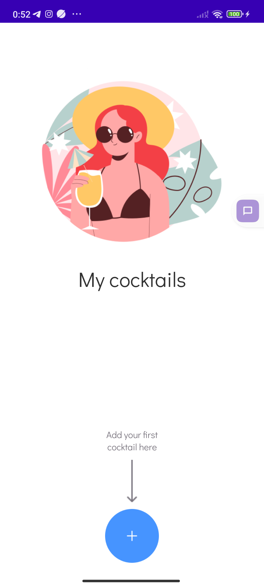
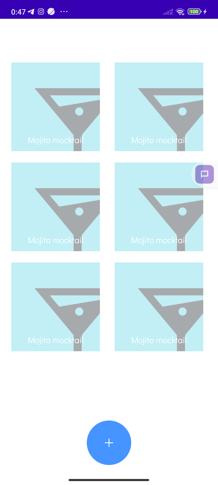
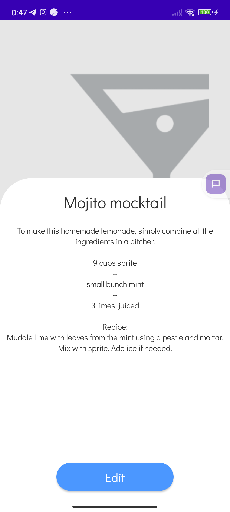
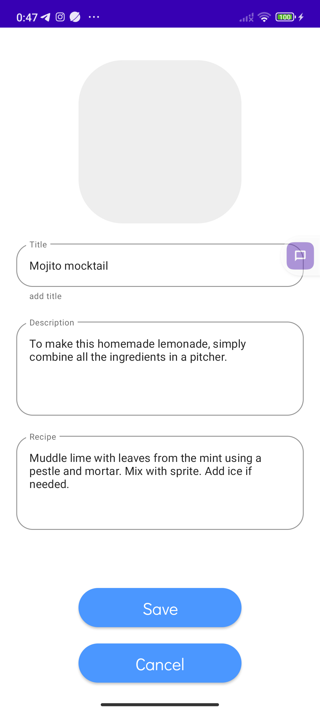
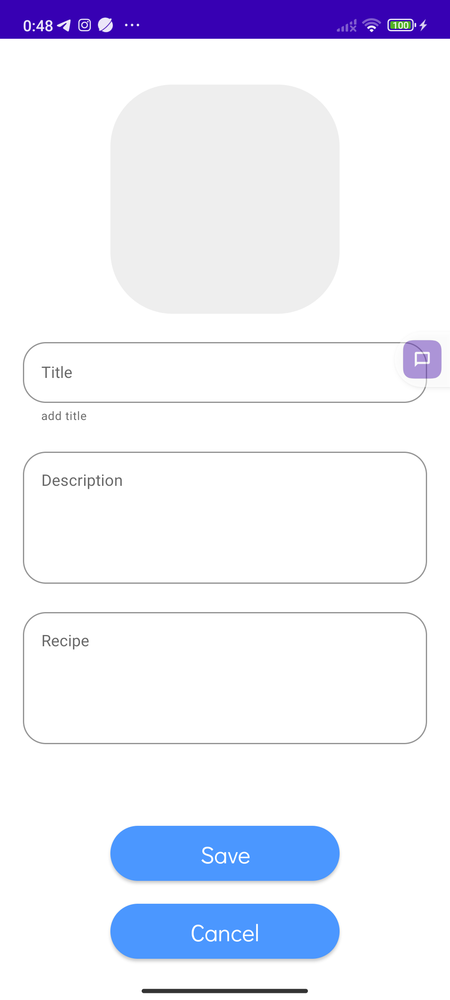

# Задание, Мобильное приложение для сохранения рецептов.
было реализовано следующее:
- главная страница со списком
- страница с деталями
- страница для редактирования/создания рецепта
- навигация по страницам

не успел реализовать:
- получение пермишенов для получения картинок из галереи
- хранение рецептов (сделал бы рум, только для того что бы паказать свои знания), при реализации удаления не было бы трудностей
- катомные компоненты (кнопка добавления, список ингредиентов на странице редактирования, картинки с закругленными углами)
- диалог для добавления ингридиентов
- так же подключить библиотеку для подгрузки картинок coil (Glide or picasso)
- разнести ресурсы по своим места (размеры, цвета, стили)
- шаринг рецептов

что можно был бы сделать лучше:
- валидацию на странице редактирования/создания рецепта. при изменении чего нибудь делать доступной кнопку сохранить.
- поиск по пецептам на экране со списком рецептов

нашел ошибку когда делал скриншоты:
в TextView во fragment_list.xml нужно у title и info, tools:text заменить на android:text

Спасибо за интересное задание и интересный опыт.